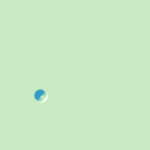
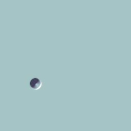

# Capillary Waves · Ripples on the GPU

> Part of [**flow-gallery**](../) — a collection of interactive capillary-effect simulations.

Real-time **gravity–capillary surface waves**: drop a stone in the pond and
watch the ripples spread, interfere and decay. The tiniest ripples race
outward *ahead* of the longer swell — the visual fingerprint of surface
tension, which stiffens short wavelengths and speeds them up.

The live demo runs entirely on the GPU (WebGL2). A
[Python reference solver](python/capillary_waves.py) propagates the **exact**
linear dispersion in Fourier space and generates the animations below.

**▶ Live demo:** https://dmitrylobuznov.github.io/flow-gallery/capillary-waves/

<p align="center">
  
  
  
</p>

## The physics

Small-amplitude waves on a pond of depth $H$ obey the **gravity–capillary
dispersion relation**

$$
\omega(k)^2 = \left( g\,k + \frac{\sigma}{\rho}\,k^3 \right)\tanh(kH),
$$

where $k = \lvert\mathbf{k}\rvert$ is the wavenumber. The two restoring forces
split by scale:

- $g\,k$ — **gravity**, dominant at long wavelengths (small $k$).
- $(\sigma/\rho)\,k^3$ — **surface tension**, dominant at short wavelengths. It
  makes the group velocity $\mathrm{d}\omega/\mathrm{d}k$ *increase* with $k$, so
  the smallest ripples outrun everything else and sit on the leading edge.
- $\tanh(kH)$ — the **finite-depth** factor: deep water ($kH \gg 1$) → $1$;
  shallow water ($kH \ll 1$) → $kH$, giving non-dispersive long waves.

The crossover between the two regimes happens at the wavelength of minimum
phase speed, $\lambda_c = 2\pi\sqrt{\sigma/\rho g}$ — about **1.7 cm** for
air–water. Below it, ripples are capillary; above it, gravity waves.

## How it's solved

| | Live demo (`js/`) | Reference (`python/`) |
|---|---|---|
| Model | Local PDE $\partial_t^2 h = g\nabla^2 h - \sigma\nabla^4 h - 2\zeta\partial_t h$ | Exact linear dispersion $\omega(k)$ |
| Method | Explicit leapfrog, 13-point biharmonic stencil | Fourier propagator (no time-step error) |
| Dispersion | $\omega^2 \approx g k^2 + \sigma k^4$ (capillary-like proxy) | $\omega^2 = (gk + \tfrac{\sigma}{\rho}k^3)\tanh(kH)$ (textbook) |
| Stability | dt auto-capped to the leapfrog limit | unconditional |
| Boundaries | Periodic | Periodic (FFT) |

The browser demo trades the exact non-local dispersion for a fast local
biharmonic proxy — still dispersive, still shows short ripples leading, and it
runs at hundreds of steps per second on the GPU. Released from rest, every
Fourier mode of the reference is a damped oscillator,

$$
\hat{h}(\mathbf{k}, t) = \hat{h}_0(\mathbf{k})\,\cos\!\big(\omega(k)\,t\big)\,e^{-\gamma t},
$$

so each frame is a single inverse FFT — exact in time.

## Interactive controls

- **Surface tension σ** — capillary stiffness; raise it and short ripples sharpen and speed up.
- **Gravity g** — long-wave restoring force / overall wave speed.
- **Damping** — how fast the pond returns to calm.
- **Steps / frame**, **Look** (caustic water · ocean · mercury · schlieren).
- **Rain** — auto-spawns random drops. **Drag** on the canvas to make waves yourself.
- **⟨space⟩** rain on/off · **⟨r⟩** calm.

## Run it

**Live demo** — open `index.html`, or serve the folder:

```bash
python -m http.server 8000   # then open http://localhost:8000
```

**Python reference / GIF generation** — managed with [uv](https://docs.astral.sh/uv/):

```bash
cd python
uv run python capillary_waves.py --drops 1 --sigma 0.45 --g 0.25 --damping 0.02 --cmap water   --gif ../assets/ripple.gif
uv run python capillary_waves.py --drops 6 --sigma 0.40 --g 0.30 --damping 0.03 --cmap ocean --seed 3 --frames 150 --gif ../assets/rain.gif
uv run python capillary_waves.py --drops 1 --sigma 0.45 --g 0.25 --damping 0.02 --cmap mercury --gif ../assets/mercury.gif
```

Run `uv run python capillary_waves.py --help` for all parameters (depth, fps, frames, …).

## References

- L. D. Landau & E. M. Lifshitz, *Fluid Mechanics*, §62 (capillary waves).
- H. Lamb, *Hydrodynamics*, 6th ed., Ch. IX (surface waves).

## License

[MIT](../LICENSE) © 2026 Dmitry Lobuznov
