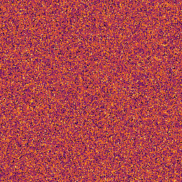

# Marangoni Convection · Cells on the GPU

> Part of [**flow-gallery**](../) — a collection of interactive capillary-effect simulations.

Heat a thin liquid layer from below. Surface tension falls with temperature, so
a warm spot pulls liquid outward along the surface while cooler liquid sinks —
and above a critical **Marangoni number** the layer spontaneously organises into
a lattice of **convection cells**. It's the pattern in a pan of hot oil, a
drying paint film, and the "tears of wine".

The live demo runs entirely on the GPU (WebGL2): cells nucleate from noise,
compete, and anneal into hexagons or rolls. A
[Python reference solver](python/marangoni.py) integrates the same equation
spectrally and generates the animations below.

**▶ Live demo:** https://dmitrylobuznov.github.io/flow-gallery/marangoni/

<p align="center">
  
  
  
</p>

## The physics

Right at onset, convection pattern formation is described by the
**Swift–Hohenberg equation** — the canonical amplitude model for
Rayleigh–Bénard and Marangoni convection (Cross & Hohenberg, *Rev. Mod. Phys.*
**65**, 851, 1993). For the convection amplitude $u(x,y)$ (essentially the local
surface temperature / upwelling):

$$
\frac{\partial u}{\partial t} = r\,u - (1+\nabla^2)^2\,u + g\,u^2 - u^3 .
$$

- $r$ — the **drive**, a proxy for how far the Marangoni number sits above onset.
- $(1+\nabla^2)^2$ — the **pattern-selecting** operator: it amplifies a band of wavenumbers around $|k| = 1$, so a pattern of wavelength $2\pi$ emerges (the cell size).
- $g\,u^2 - u^3$ — **saturation**. The cubic caps the amplitude (the pattern is always bounded — the solver can't blow up). The quadratic $g$ breaks the up/down symmetry and selects **hexagons** — the hallmark Marangoni cell — over **rolls** (which win when $g = 0$).

Why hexagons for Marangoni? The temperature-dependence of surface tension is a
quadratic (non-Boussinesq) effect, which is exactly what the $g\,u^2$ term
encodes — so surface-tension-driven convection prefers hexagonal cells, while
purely buoyant convection (symmetric) tends to rolls.

## How it's solved

| | Live demo (`js/`) | Reference (`python/`) |
|---|---|---|
| Method | Explicit Euler, finite differences | Semi-implicit, exact linear operator in Fourier |
| Operator | 5-point $\nabla^2$ + 13-point $\nabla^4$ | $(1-k^2)^2$ in Fourier space |
| Stability | dt auto-capped to the explicit limit | unconditional (stiff part implicit) |
| Boundaries | Periodic | Periodic (FFT) |

The browser writes $(1+\nabla^2)^2 = 1 + 2\nabla^2 + \nabla^4$ as local stencils
and steps explicitly (dt auto-capped); the Python reference treats the stiff
linear operator exactly in Fourier space. Both saturate by construction.

## Interactive controls

- **Drive r** — distance above onset. Higher → rolls/labyrinths; lower (near onset) → clean hexagonal cells.
- **Hexagon bias g** — $0$ gives stripes/rolls; large $g$ gives hexagonal Marangoni cells.
- **Steps / frame**, **Look** (inferno · magma · viridis · thermal).
- **Paint** — drag to perturb the layer (right-drag cools), nucleating new cells.
- **⟨space⟩** play/pause · **⟨r⟩** reset.

## Run it

**Live demo** — open `index.html`, or serve the folder:

```bash
python -m http.server 8000   # then open http://localhost:8000
```

**Python reference / GIF generation** — managed with [uv](https://docs.astral.sh/uv/):

```bash
cd python
uv run python marangoni.py --r 0.08 --g 1.5 --cells 11 --steps 6000 --cmap inferno --seed 1 --gif ../assets/cells.gif
uv run python marangoni.py --r 0.5  --g 0.0 --cells 10 --cmap magma   --gif ../assets/rolls.gif
uv run python marangoni.py --r 0.3  --g 1.0 --cells 12 --cmap viridis --seed 3 --gif ../assets/labyrinth.gif
```

Run `uv run python marangoni.py --help` for all parameters (cells, dt, …).

## References

- M. C. Cross & P. C. Hohenberg, *Pattern formation outside of equilibrium*, Rev. Mod. Phys. **65**, 851 (1993).
- J. Swift & P. C. Hohenberg, *Hydrodynamic fluctuations at the convective instability*, Phys. Rev. A **15**, 319 (1977).
- E. L. Koschmieder, *Bénard Cells and Taylor Vortices* (1993).

## License

[MIT](../LICENSE) © 2026 Dmitry Lobuznov
