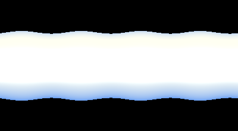
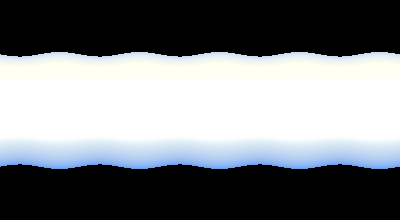

# Rayleigh–Plateau · Jet Break-up on the GPU

> Part of [**flow-gallery**](../) — a collection of interactive capillary-effect simulations.

Why does a stream of water from a tap break into drops? A liquid column is
**unstable**: surface tension can lower its area by pinching it into a chain of
beads. This is the **Rayleigh–Plateau instability** — the same physics behind
inkjet printing and the beading of dew on a spider's web.

The live demo runs entirely on the GPU (WebGL2): a liquid jet necks, pinches,
and breaks — then re-forms and does it again. A
[Python reference solver](python/rayleigh_plateau.py) integrates the same
slender-jet equations and generates the animations below.

**▶ Live demo:** https://dmitrylobuznov.github.io/flow-gallery/rayleigh-plateau/

<p align="center">
  
  
  
</p>

## The physics

A radius perturbation $h = R_0 + \epsilon\cos(kz)$ on a column changes its
surface area. Because volume is fixed, a long-wavelength squeeze *reduces* area
and is therefore favoured: the column is unstable whenever

$$
k R_0 < 1 \quad\Longleftrightarrow\quad \lambda > 2\pi R_0,
$$

i.e. when the wavelength exceeds the circumference. Among all unstable modes the
**fastest-growing** one is $\lambda \approx 9.02\,R_0$ ($kR_0\approx 0.697$) —
that sets the spacing of the droplets. Small **satellite droplets** often appear
between the main beads, a hallmark of the nonlinear pinch-off.

We solve the one-dimensional **slender-jet (lubrication) equations** of Eggers &
Dupont for the radius $h(z,t)$ and axial velocity $v(z,t)$:

$$
\partial_t(h^2) = -\partial_z(h^2 v), \qquad
\partial_t v = -v\,\partial_z v - \partial_z \kappa + \frac{3\nu}{h^2}\,\partial_z(h^2\,\partial_z v),
$$

with the full mean curvature of the free surface providing the Laplace pressure

$$
\kappa = \frac{1}{h\sqrt{1+h_z^2}} - \frac{h_{zz}}{(1+h_z^2)^{3/2}}.
$$

The $-\partial_z\kappa$ term drives the instability; the viscous term (set by the
viscosity $\nu$) regularises the pinch and controls satellites. Volume
$\int h^2\,dz$ is conserved.

## How it's solved

| | Live demo (`js/`) | Reference (`python/`) |
|---|---|---|
| State | $h, v$ in one row of an RGBA32F texture | NumPy arrays |
| Method | Explicit RK2 (two shader passes / step) | Explicit RK2 |
| Curvature | full nonlinear $\kappa$, central differences | full nonlinear $\kappa$ |
| Pinch-off | the 1D model can't snap the neck → auto-reset & re-seed | stop capture at pinch, then hold |
| Domain | periodic column | periodic column |

Once the thinnest neck reaches a small radius, the slender-jet model can no
longer represent the topology change (the neck actually separating), so the
browser demo **auto-resets** the column for a clean loop, and the Python GIFs
stop at pinch and linger on the droplets.

## Interactive controls

- **Droplets** — how many beads form (waves along the column). Fewer drops → longer, faster-growing waves. Resets the jet.
- **Viscosity ν** — thick, syrupy jets pinch slowly and smoothly (fewer satellites).
- **Steps / frame**, **Look** (water · gold · mercury · magma).
- **⟨space⟩** play/pause · **⟨r⟩** new jet.

## Run it

**Live demo** — open `index.html`, or serve the folder:

```bash
python -m http.server 8000   # then open http://localhost:8000
```

**Python reference / GIF generation** — managed with [uv](https://docs.astral.sh/uv/):

```bash
cd python
uv run python rayleigh_plateau.py --modes 4 --visc 0.15            --gif ../assets/breakup.gif
uv run python rayleigh_plateau.py --modes 5 --length 40 --visc 0.12 --seed 2 --gif ../assets/beads.gif
uv run python rayleigh_plateau.py --modes 3 --visc 0.30 --seed 5    --gif ../assets/viscous.gif
```

Run `uv run python rayleigh_plateau.py --help` for all parameters (length, amplitude, dt, …).

## References

- Lord Rayleigh, *On the instability of jets*, Proc. London Math. Soc. **10**, 4 (1878).
- J. Plateau, *Statique expérimentale et théorique des liquides…* (1873).
- J. Eggers & T. F. Dupont, *Drop formation in a one-dimensional approximation of the Navier–Stokes equation*, J. Fluid Mech. **262**, 205 (1994).
- J. Eggers, *Nonlinear dynamics and breakup of free-surface flows*, Rev. Mod. Phys. **69**, 865 (1997).

## License

[MIT](../LICENSE) © 2026 Dmitry Lobuznov
